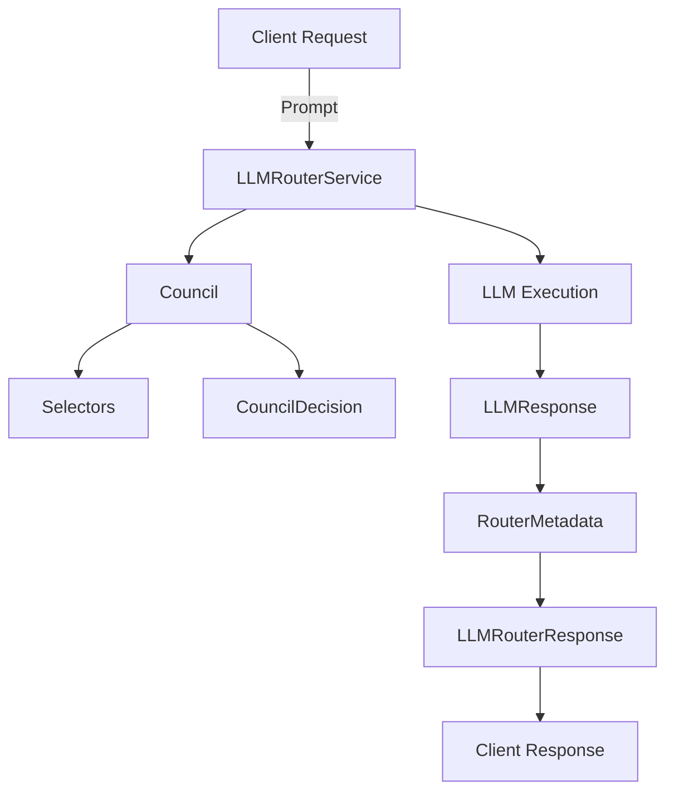

# LLMRouterService

A modular, extensible service for orchestrating and routing requests to multiple Large Language Models (LLMs) using council-based decision logic, selectors, and robust metadata tracking.

## Architecture Overview



## Components

### Councils (`llm_router/councils/`)
- **Purpose:** Aggregate votes from selectors and make a final model selection.
- **Files:**
  - `random.py`: Randomized council decision logic.
  - `iterative.py`: Iterative voting and selection.
  - `weighted.py`: Weighted voting and aggregation.

### Selectors (`llm_router/selectors/`)
- **Purpose:** Implement model selection strategies (heuristics, classifiers, SLMs).
- **Files:**
  - `classifier.py`: Classifier-based selection.
  - `heuristics.py`: Heuristic-based selection.
  - `slm.py`: SLM-based selection.

### Routers (`llm_router/routers/`)
- **Purpose:** Main service interface for routing requests, executing LLM calls, and logging.
- **Files:**
  - `router.py`: Core router service logic.
  - `prompt_templates.py`: Prompt template wrappers for logging.

### Schemas (`llm_router/schemas/`)
- **Purpose:** Define data contracts for council decisions, LLM responses, and metadata.
- **Files:**
  - `council_schemas.py`: Main schemas for responses and decisions.
  - `abstractions.py`, `config.py`: Abstract base classes and configuration schemas.

### Exceptions (`llm_router/exceptions/`)
- **Purpose:** Custom exception handling for router and council logic.
- **Files:**
  - `exceptions.py`: Exception definitions.

## API Contracts

### Schemas

#### `LLMResponse`
```python
class LLMResponse(BaseModel):
    model: str
    prompt: str
    response: str
    cost: float
    latency: float
```

#### `RouterMetadata`
```python
class RouterMetadata(BaseModel):
    votes: Optional[List[Dict[str, Any]]] = None
    weighted_results: Optional[Dict[str, Any]] = None
    tags: Optional[List[str]] = None
```

#### `LLMRouterResponse`
```python
class LLMRouterResponse(LLMResponse):
    metadata: Optional[RouterMetadata] = None
```

#### `CouncilDecision`
```python
class CouncilDecision(BaseModel):
    final_model: str
    votes: List[SelectorVote]
    weighted_results: Dict[str, float]
    metadata: Dict[str, str] = {}
```

### Main Service: `LLMRouterService`

#### Methods
- `invoke(prompt: str) -> LLMRouterResponse`
  - **Input:** Prompt string
  - **Output:** Structured LLMRouterResponse with metadata

#### Example Request
```json
{
  "prompt": "What is the capital of France?"
}
```

#### Example Response
```json
{
  "model": "gpt-3.5-turbo",
  "prompt": "What is the capital of France?",
  "response": "The capital of France is Paris.",
  "cost": 0.002,
  "latency": 0.45,
  "metadata": {
    "votes": [
      {"selector_name": "HeuristicsSelector", "model": "gpt-3.5-turbo", "weight": 1.0, "rationale": "Best for general knowledge."}
    ],
    "weighted_results": {"gpt-3.5-turbo": 1.0},
    "tags": ["council-router", "local-llm"]
  }
}
```

## Usage

1. **Install dependencies:**
   ```bash
   poetry install
   ```
2. **Configure environment:**
   - Set your LLM API keys in `.env`.
3. **Run the service:**
   - Import and use `LLMRouterService` in your application.

## Extending
- Add new selectors or councils by implementing the appropriate base classes in `schemas/abstractions.py`.
- Customize routing logic in `routers/router.py`.

## License
MIT

